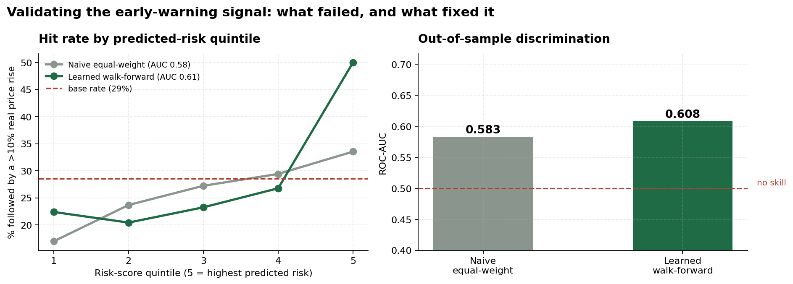
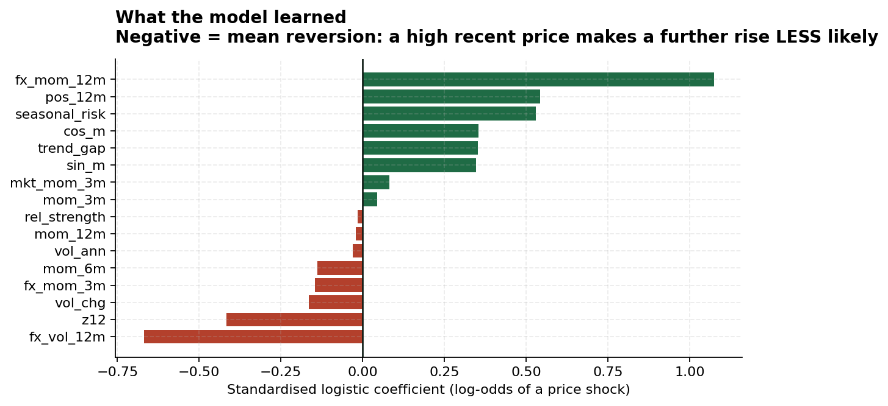
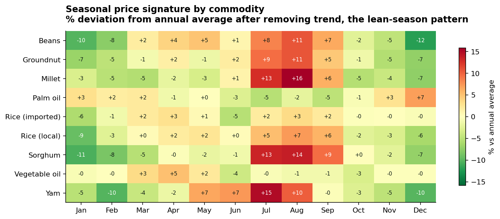
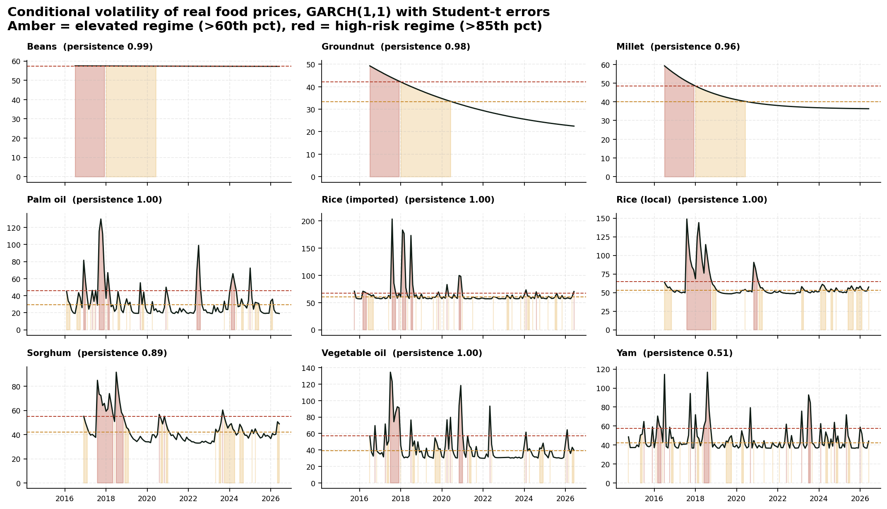

# Nigeria Food Price Early Warning System

Tracking volatility and forecasting price shocks across 9 staple foods, 68 markets and 14 Nigerian states, with the warning signal properly tested.

*Halimat H. Fakorede, Agricultural Data Scientist and Operations Analyst*
[Live dashboard](https://nigeria-food-price-early-warning.streamlit.app) | [LinkedIn](https://linkedin.com/in/halimatfakorede)

---

## The question

Food price spikes hit Nigerian households well before anyone officially notices. By the time a crisis is declared, the damage is done. Can market price data that already exists give three months of warning?

The system does four things. It tracks real, inflation adjusted staple prices across 68 markets. It picks up volatility regimes with GARCH, so you can see when a market flips from calm to turbulent. It maps the seasonal pattern, which is the predictable part of the year. And it produces a shock risk score, then tests whether that score is worth anything.

---

## The most useful part of this project is that the first version failed

Anyone can build a composite risk index. Very few people check whether it predicts anything. I checked, and it did not.

The first attempt was an equal weighted composite of four sensible indicators: 3 month momentum, GARCH volatility, trend gap and seasonal risk. It scored a ROC-AUC of **0.583**, which is barely better than a coin flip.

To work out why, I correlated each component against the thing it was supposed to predict, the next 3 months' real return:

| Component | Correlation with future 3 month return |
|---|---|
| Momentum (3m) | **-0.19** |
| Trend gap | **-0.09** |
| Conditional volatility | -0.03 |
| Seasonal risk | **+0.20** |

Nigerian staple food prices mean revert over three months. A price that has just spiked is more likely to fall back than to keep climbing, because harvest arrives, traders release stock and households switch to substitutes. My composite gave momentum and trend gap positive weights, so two of the four components were pointing the wrong way and cancelling out the only one that worked.

The second attempt learned the weights instead of assuming them. Logistic regression, validated walk forward, with exchange rate and market wide features added.



| | Naive equal weight | Learnt, walk forward |
|---|---|---|
| ROC-AUC | 0.583 | **0.608** |
| Top quintile hit rate | 33.5% | **50.0%** |
| Lift over the 28.6% base rate | 1.28x | **1.75x** |

Months in the top risk quintile are followed by a real price rise of more than 10% half the time, against a base rate of 28.6%. That is modest discrimination and I say so in the dashboard. An AUC of 0.61 is real skill for three month food price prediction, but it is not a precise forecast.

---

## The finding that surprised me



The strongest single predictor is 12 month naira depreciation, and it beats every price based technical indicator in the model.

I derived the exchange rate from the price data itself. WFP reports every observation in both naira and USD, so the ratio of the two is the rate they applied. No second source to reconcile, and the calendar lines up perfectly. The series correctly reproduces the 2023 float at about 685 naira and the 2024 devaluation at about 1,566, which is a good sign it is right.

For imported rice and vegetable oil this is direct pass through. For domestic cereals it works through imported fertilizer, diesel and transport. Any Nigerian food price warning system that leaves FX out is missing its most important variable, and most of them do.

---

## The lean season is the most useful pattern in the data



| Commodity | Peak month | Premium over annual average |
|---|---|---|
| Millet | August | +15.8% |
| Yam | July | +15.2% |
| Sorghum | August | +13.8% |
| Beans | August | +11.5% |
| Groundnut | August | +10.6% |

Cereals peak in August, right before the main harvest. That is the classic West African lean season, when household stocks have run out and the new crop is not in yet.

This pattern is large, it repeats every year, and it can be predicted a year ahead. Procurement, cash transfer timing and buffer stock release can all be planned around it, which honestly makes it more useful than any model output in this repo.

---

## Volatility regimes



GARCH(1,1) with Student t errors, fitted on monthly real log returns. I used Student t rather than normal because food price returns are fat tailed, and a normal GARCH understates exactly the spikes this system exists to catch. Regimes are set at the 60th and 85th percentile of each commodity's own fitted conditional volatility.

Four of the nine series are effectively IGARCH, with persistence at about 1.00: imported rice, local rice, palm oil and vegetable oil. Their unconditional variance is not finite, so volatility shocks never really decay and long horizon volatility forecasts from them should not be trusted. This is flagged in the dashboard rather than hidden, because quietly publishing a 12 month volatility forecast off an IGARCH model is the kind of thing that discredits a risk system.

Imported rice is the most volatile staple at roughly 70% annualised, which makes sense for the commodity most exposed to FX.

---

## Repository

```
src/
  data_prep.py      download, normalize units, deflate, build panels
  model.py          GARCH, seasonality, point in time features,
                    walk forward validation, SARIMA forecasts
app.py              Streamlit dashboard, 6 tabs
data/raw/           WFP price file, CPI
data/processed/     national, state and long history panels
outputs/figures/
outputs/tables/     current status, backtest, seasonality, forecasts
outputs/model_results.json
FINDINGS.md
```

To reproduce:

```bash
git clone https://github.com/HalimatFakorede/nigeria-food-price-early-warning
cd nigeria-food-price-early-warning
pip install -r requirements.txt

python src/data_prep.py
python src/model.py
streamlit run app.py
```

No API keys and no login needed.

---

## Data and method

| Source | What | Access |
|---|---|---|
| WFP via HDX, Nigeria Food Prices | 88,545 observations, 68 markets, 14 states, retail and wholesale, 2002 to 2026 | Open CSV |
| World Bank WDI | Nigeria CPI, used to deflate | Open API |
| Derived | NGN/USD rate, calculated as naira price divided by USD price | |

Here is what the pipeline does and why each step is there.

**Unit normalization.** Prices come as 100 KG, 2.5 KG, 400 G, L, KG and more. A raw price column is meaningless across rows, since comparing 175 naira per 100 kg to 175 naira per kg is a 100x error. Everything is converted to naira per kg first, and anything the parser cannot read is dropped and counted, which came to 0.5% of rows.

**Outlier control.** Winsorized at the 1st and 99th percentile within commodity and price type. Market data contains data entry errors of 10x to 100x, and one of those will completely dominate a GARCH variance estimate.

**Aggregation.** Monthly median across markets rather than mean, since the median resists whatever outliers survive. Months with fewer than 3 reporting markets are dropped. The last month in the raw file had exactly one market reporting, and without this filter the dashboard would have shown one trader in one town as the national price.

**Deflation.** Nominal naira divided by CPI, rebased to constant January 2020 naira. Nigerian inflation is high enough that nominal prices are close to useless for studying volatility.

**Separate panels, not spliced.** Retail runs 2014 to 2026, wholesale runs 2002 to 2023 and then stops. It is tempting to join them for a longer history, but retail and wholesale are different price concepts with different margins, so they stay separate.

**Point in time features.** The GARCH model and the seasonal index are re-estimated on an expanding window at every single month, so nothing in the feature set has seen the future.

**Walk forward validation.** At each prediction month, training uses only observations whose 3 month outcome window had already closed.

---

## Limitations

An AUC of about 0.61 is modest skill. It is useful for deciding which commodities to watch and for timing procurement. It is not a price forecast and should never be the only input to a food security decision.

Retail data only starts in 2014, so the model cannot learn from the 2008 or 2012 crises.

CPI is annual and interpolated to monthly. Nigeria publishes monthly CPI and using it would sharpen the real price series. I used the World Bank annual series because it is openly accessible without scraping.

Market coverage is missing in a way that is not random. Conflict affected northern states have gaps at exactly the times their prices are most volatile, which will bias any national average.

Maize, gari and cowpea retail series were discontinued in 2023, so they are not in the live system.

This is a monitoring and prioritization tool, not a structural model of how food prices form.

---

**Halimat H. Fakorede** | fakoredehalimat1@gmail.com | [LinkedIn](https://linkedin.com/in/halimatfakorede) | [GitHub](https://github.com/HalimatFakorede)
